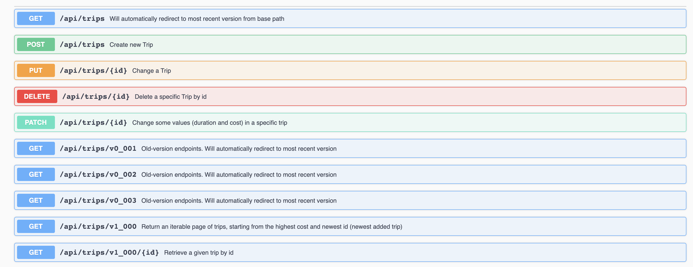

#PG6102 EXAM 

###Candidate number / kandidatnummer: 10003
___

To start(test) Trip api:
Right click LocalApplicationRunner in path `test/kotlin/no.pg6102exam.trip/`
Trips will be available on base path `http://localhost:8080/api/trips/v1_000`
(v1_000 = latest version of trips)

To run tests in Trip by themselves, right click on 
`RestApiTest` in `test/kotlin/no.pg6102exam.trip/` (run with coverage)
--> should give 82 % line coverage
(All tests should run.)

Swagger-ui is shown on:
`http://localhost:8080/swagger-ui/`
(and not " http://localhost:8080/swagger-ui.html ")

The fake test data is generated by the data.sql script in
`test/resources/`.
(30 trips --> gives three pages)

To start application with docker-compose:
run `docker-compose up` in root
Trips will be available on `http://localhost:80/api/trips/v1_000`

(The application is manually tested with Postman and all main HTTP methods should be working)

* GET (all) --> /api/trips/v1_000

* GET (id) --> /api/trips/v1_000/{trip_id}

* POST --> /api/trips/

* PUT --> /api/trips/{trip_id}

* PATCH --> /api/trips/{trip_id}   (change duration and cost)

* DELETE --> /api/trips/{trip_id}

---

##R1: 

[x] Write a new REST API using SpringBoot and Kotlin.

[x] Have AT LEAST one endpoint per main HTTP method, i.e., GET, POST, PUT, PATCH and DELETE.

[x] Each endpoint MUST use Wrapped Responses.

[x] Endpoints returning collections of data MUST use Keyset Pagination, 
unless you can convincedly argue (in code comments) that they do not deal with large 
quantity of data, and the size is always small and bounded. Example: an endpoint that 
returns the top 10 players in a leader-board for a game does not need to use Pagination.

[x] MUST provide OpenAPI/Swagger documentation for all your endpoints.

[x] Write AT LEAST one test with RestAssured per each endpoint.

[x] Add enough tests (unit or integration, it is up to you) such that, 
when they are run from IntelliJ, they MUST achieve AT LEAST a 70% code coverage.
--> 82 % (line)

[n] If the service communicates with another REST API, you need to use 
WireMock in the integration tests to mock it, and use as well a Circuit Breaker.

[x] You MUST provide a LocalApplicationRunner in the 
test folder which is able to run the REST API independently from the whole 
microservice. If such REST API depends on external services (e.g., Consul), 
those communications can be deactivated or mocked out (or simply live with the 
fact that some, but not all, endpoints will not work). It is ESSENTIAL that an 
examiner MUST be able to start such class with simply a right-click on an IDE 
(e.g., IntelliJ), and then see the OpenAPI/Swagger documentation when opening 
http://localhost:8080/swagger-ui.html in a browser.
(--> swagger-ui on http://localhost:8080/swagger-ui/)
 
[x] In “production” mode, the API MUST be configured to connect to a PostgreSQL 
database. During testing, you can use an embedded database (e.g., H2), and/or 
start the actual database with Docker.

[x] You MUST use Flyway for migration handling (e.g., for the creation of the 
database schema).

[x] Configure Maven to build a self-executable uber/fat jar for the service.

[x] Write a Docker file for the service.

---

##R2: 
[x] Your microservices MUST be accessible only from a single entry point, i.e., 
an API Gateway.

[x] Your whole application must be started via Docker-Compose. The API Gateway MUST be 
the only service with an exposed port.

[x] You MUST have at least one REST API service that is started more than once (i.e., 
more than one instance in the Docker-Compose file), and load-balanced (use service-discovery, e.g., 
Consul).

[x] In Docker-Compose, MUST use real databases (e.g., PostgreSQL) instead of 
embedded ones (e.g.,H2) directly in the services.

[] You MUST have at least 1 end-to-end test for each REST API using Docker-Compose 
starting the whole microservice.
--> implemented, but curently not working on my computer
(Caused by: com.github.dockerjava.api.exception.NotFoundException: 
{"message":"No such image: quay.io/testcontainers/ryuk:0.2.3"})
You can uncomment the RestIT-class to check if it runs on your computer.

---

##T1:

[x] REST API to handle trip details: e.g., place, duration and cost per person.

[x] When the API starts, it must have some already existing data.

[x] All requirements in R1 must be satisfied.

Did not do R3, R4, R5, T2, T3, T4.

(
Although I have the code for R3 in auth module, it´s not currently implemented with trip.
I have some problems with testcontainers, so I cannot test that it's working.
I don't know if something is wrong with my computer (or docker on my computer)
or if it's something wrong with the code (should be mostly copy/paste from course repository)

--> in auth: 

    "Caused by: org.testcontainers.containers.ContainerLaunchException: Timed out waiting for container port to open (localhost ports: [49156] should be listening)"
    
    "org.testcontainers.containers.ContainerLaunchException: Container startup failed"
            
This will also negatively impact the tests in Trip module.
Therefore, auth/security is not implemented in Trip Module.
)
